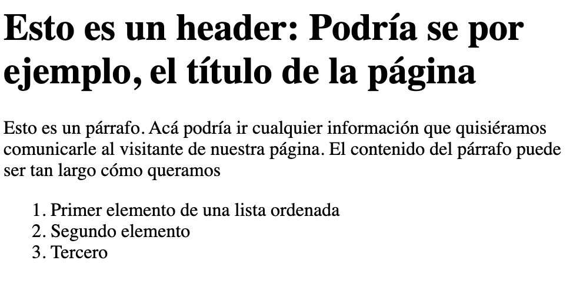

# Introducción a HTML & HTML5

HTML significa **H**yper**T**ext **M**arkup **L**anguage, es un lenguaje de marcado que describe la estructura del contenido de una página web.

Usa una sintáxis especial o podríamos llamarla también notación, para darle información a los navegadores web, acerca de la página y la información que está contiene, es decir, es hablar con los navegadores web y decirles por medio de un lenguaje de marcas que estos conocen, cómo queremos que esa información se vea.

Los elementos que se pueden usar en html se describen por medio de etiquetas (en inglés tags) que rodean el contenido.

Por ejemplo, hay diferentes etiquetas que pueden ponerse alrededor de un texto para decirle al navegador que ese contenido es un encabezado 
```html 
<h1>texto encabezado</h1>
```

un párrafo
```html 
<p>esto es un párrafo</p>
```

o una lista
```html 
<ul>
  <li>primer elemento de la lista</li>
  <li>segundo</li>
  <li>tercero</li>
</ul>
```

## Ahora veamos esto en acción: 
 1) creemos un archivo dentro de esta carpeta y nombremoslo ejemplo1.html
 2) copiemos el siguiente código dentro de ese archivo

```html
<h1>Esto es un header: Podría ser por ejemplo, el título de la página</h1>

<p>Esto es un párrafo. Acá podría ir cualquier información que quisiéramos comunicarle al visitante de nuestra página. El contenido del párrafo puede ser tan largo cómo queramos
</p>

<ol>
  <li>Primer elemento de una lista ordenada</li>
  <li>Segundo elemento</li>
  <li>Tercero</li>
</ol>
```

El resultado debería ser el siguiente:




La parte de **H**iper **T**exto de html ha sido la misma desde su creación.

Desde los inicios las páginas web normalmente han sido documentos de contenido estático que a su vez tienen referencias a otros documentos similares.

Las referencias de un documento a otro se llaman enlaces (en inglés links), esos links son mostrados por el navegador para que el usuarios, al dar click en estos, pueda ir a otro documento html sin tener que buscarlos manualmente.

La evolución de la web ha ido incrementando su complejidad, y para mantener estándares para que todos podamos comprenderla se creó hace algunos años el W3C, World Wide Web Consortium, este consorcio está conformado por un grupo de personas que mantienen la especificación que garantiza que una página web pueda mostrarse en un navegador.

Dicha especificación ha tenido revisiones y adiciones, las cuales han llevado a que tengamos diferentes versiones de la especificación, actualmente usamos la versión 5 de dicha especificación y es lo que conocemos con la sigla HTML5.

[Vamos a la lección número 2 de este tutorial >>>](leccion2.md)
